### SF_GIT_PJ_FINAL 

# «Машинное обучение для прогнозирования уровня грунтовых вод с учётом климатических факторов, типа водоносного горизонта и глубины промерзания почв». [project_FINAL](project_FINAL/Project_FINAL.ipynb)

## Описание

Подземные воды являются важнейшим источником пресной воды. Динамика уровня грунтовых вод зависит от многих факторов, в том числе от климатических показателей, характеристик водоносного горизонта и глубины промерзания почвы. В этом проекте выполнен анализ и обработка данных об уровне грунтовых вод, температуры воздуха, количества осадков и глубины промерзания почвы в скважине, расположенной на территории штата Небраска. Цель проекта - построить ML-модель для прогноза уровня грунтовых вод и проверить переносимость модели на другой климатический регион.

## Постановка задачи

Необходимо разработать модель машинного обучения для прогнозирования уровня грунтовых вод на основе временных рядов климатических данных и характеристик скважины. Дополнительно требуется оценить влияние отдельных факторов на динамику уровня и проверить переносимость модели на данные другой скважины.

## Основные этапы решения задачи

1. Сбор и объединение данных из различных источников;
2. Очистка и предобработка данных;
3. Формирование признаков (лаги, агрегаты);
4. Разделение выборки на обучающую и тестовую;
5. Обучение моделей (Linear Regression, Random Forest);
6. Оценка качества и анализ важности признаков.

## Использованные инструменты

**Язык программирования:** Python

**Библиотеки:**

- **pandas** — обработка и анализ данных
- **numpy** — численные вычисления
- **matplotlib** — визуализация графиков
- **seaborn** — статистическая визуализация
- **xarray** — работа с климатическими данными ERA5
- **scipy** — статистические расчёты
- **statsmodels** — анализ временных рядов
- **scikit-learn** — машинное обучение

## Результаты работы и их интерпретация

### Итоговые выводы 

В ходе работы было установлено, что наибольшее влияние на изменение уровня грунтовых вод оказывают температура воздуха, глубина промерзания и накопленные осадки. Модель Random Forest показала более высокое качество по сравнению с линейной регрессией, что свидетельствует о наличии нелинейных зависимостей в данных. Для моделирования использовалась не абсолютная глубина, а её изменение (delta), что позволило лучше учитывать динамику процесса.

## Данные проекта

### Источники данных

В рамках исследования использовались данные из открытых государственных источников США:

1. Уровни грунтовых вод — данные мониторинговых скважин, полученные из системы National Water Information System (NWIS), предоставляемой U.S. Geological Survey (USGS). Где уровень грунтовых вод представлен в виде глубины до зеркала воды относительно поверхности земли, а не абсолютной геодезической отметки. Следует учитывать, что увеличение глубины соответствует снижению уровня грунтовых вод. Таким образом, анализ выполняется в относительной системе отсчёта.
2. Климатические данные — среднемесячная температура воздуха и сумма осадков, полученные из архивов ERA5.
3. Глубина сезонного промерзания почвы — данные растрового формата (`GeoTIFF`), содержащие распределение глубины промерзания. Значения извлекались по координатам скважин с использованием библиотеки `rasterio`.

В исследовании рассматривается площадка:

• штат Nebraska — регион с выраженным континентальным климатом и сезонным промерзанием. 

### Описание данных

Исходные данные представлены файлами в форматах .txt, .nc, .GeoTIFF. Данные содержат расширенный набор параметров по каждой скважине. Из исходного набора были отобраны признаки релевантные задаче. 

В рамках данного проекта использовались следующие параметры:

1. Из .txt файлов:

* site_no - USGS номер скважины;
* lev_va — глубина до зеркала воды в футах относительно земли (feet);
* lev_dt — дата замера;
* parameter_cd - код параметра системы координат.

2. Из .nc файлов:

* 2m_temperature - параметр представляет собой температуру воздуха на высоте 2 метров над поверхностью суши, моря или внутренних водоемов. Параметр измеряется в единицах кельвина (K);
* total_precipitation - суммарные осадки в метрах водного эквивалента (meters), агрегированные на первое число месяца (накопленная сумма за месяц);
* year -  год измерения (временная метка);
* month -  месяц измерения (временная метка);
* day - день измерения (для месячных данных фиксирован);
* hour - час измерения (для месячных данных фиксирован на 00:00).

3. Из .GeoTIFF файлов:

* freeze_depth - глубина промерзания почвы (meters). Хранится в значениях пикселей растров;
* fd_yyyy_mm.tiff - временная метка: где yyyy - год, mm - месяц.

### Лицензия данных

#### US Geological Survey groundwater levels

**Лицензия** 
Public Domain

**Источник данных**
USGS location identification number:
* 404618098504401 (9N 14W 1DC 1 GIBBON);
* 340535117573501 (001S010W07R002S).
Courtesy of the U.S. Geological Survey (https://www.usgs.gov/)

#### Copernicus Climate Change Service

**Лицензия** 
CC BY (Creative Commons Attribution 4.0 International)

**Библиографическое описание:**
Copernicus Climate Change Service, Climate Data Store, (2023): ERA5 hourly data on single levels from 1940 to present. Copernicus Climate Change Service (C3S) Climate Data Store (CDS). DOI: 10.24381/cds.adbb2d47 (Accessed on 20-FEB-2026)

**Авторы данных:**
Hersbach, H., Bell, B., Berrisford, P., Biavati, G., Horányi, A., Muñoz Sabater, J., Nicolas, J., Peubey, C., Radu, R., Rozum, I., Schepers, D., Simmons, A., Soci, C., Dee, D., Thépaut, J-N. 

**Важное уведомление:**
Данные предоставлены Службой изменения климата Copernicus.
Generated using or contains modified Copernicus Climate Change Service information. 
Neither the European Commission nor ECMWF is responsible for any use that may be made of the Copernicus information or data it contains.

#### Freeze depth dataset 

**Лицензия** 
CC BY (Creative Commons Attribution 4.0 International)

**Основная информация о данных:**
Zhu, Guofeng; Huang, Enwei (2025), “Quantifying the Role of Winter Freezing in Global Drylands on Spring Soil Moisture”, Mendeley Data, V1, doi: 10.17632/7bctjyn98n.1

### Набор данных

#### Скважина в штате Небраска

**Файлы:** 

[404618098504401_Nebraska.txt](data/404618098504401_Nebraska.txt)

[era5_precip_combined_Nebraska.nc](data/era5_precip_combined_Nebraska.nc)

[era5_temp_combined_Nebraska.nc](data/era5_temp_combined_Nebraska.nc)

[404618098504401_well_freeze_df.csv](data/404618098504401_well_freeze_df.csv)

**Примечание:** Для работы с проектом скачайте файлы и поместите их в корневую папку проекта.

## Визуализация данных

### Основные визуализации

**Статические графики (PNG):**

* 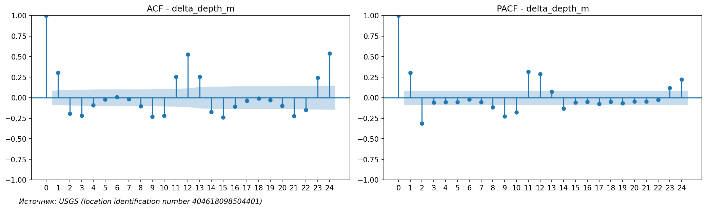
* 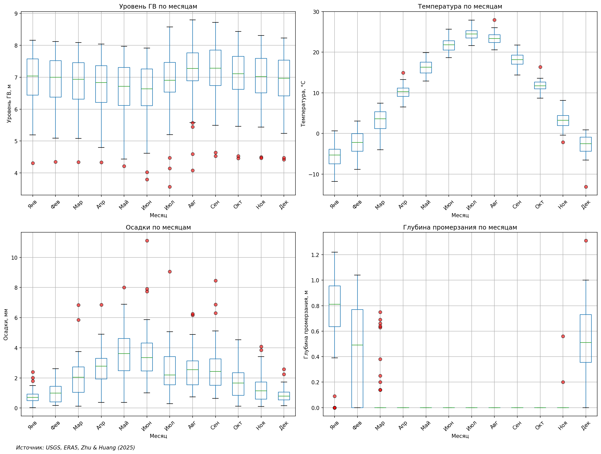
* 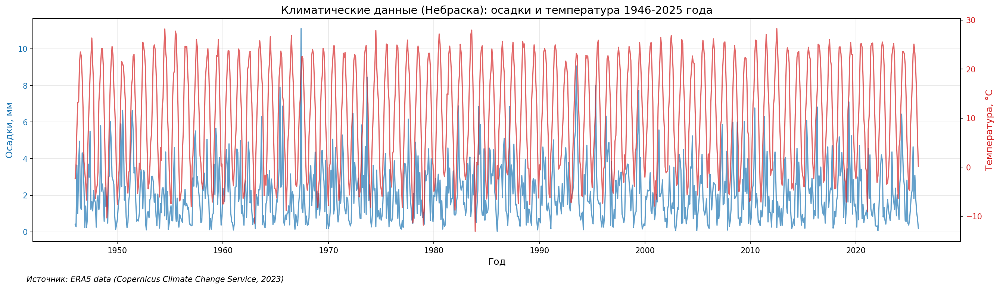
* 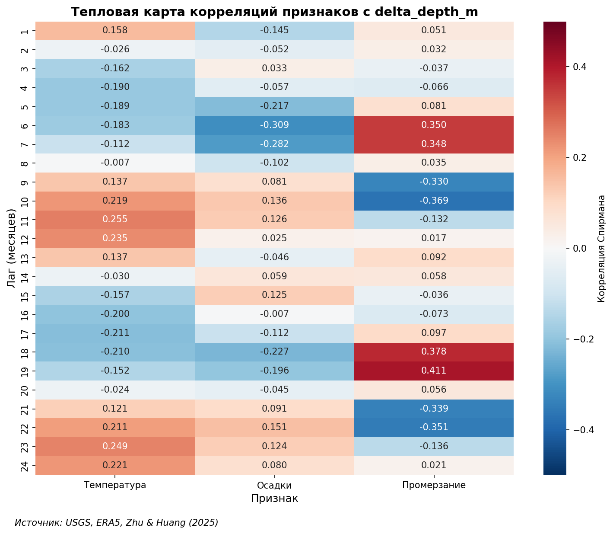
* 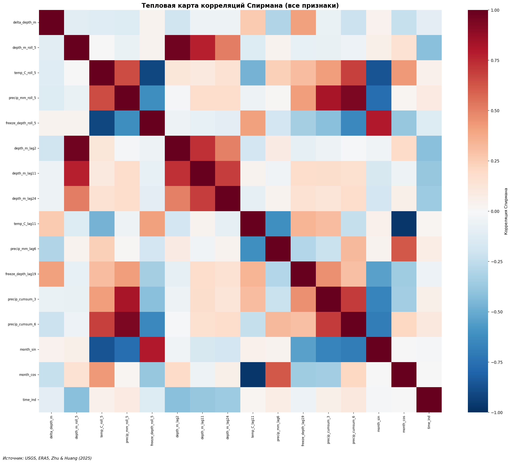
* 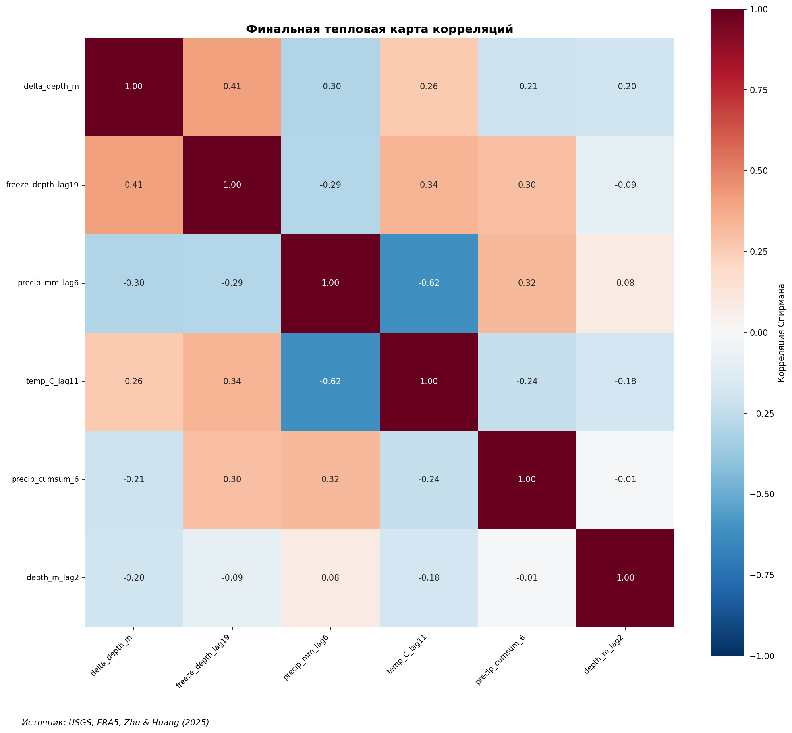
* 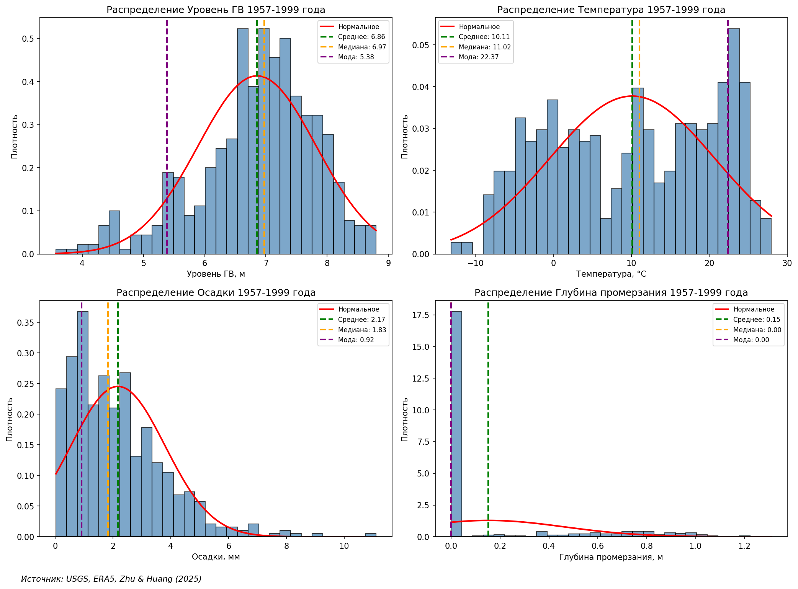
* 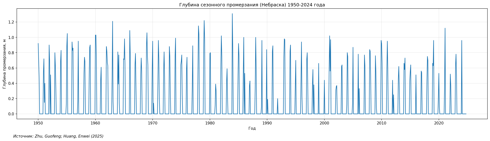
* 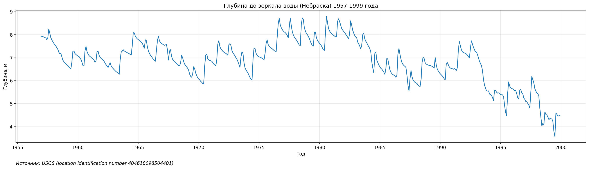
* 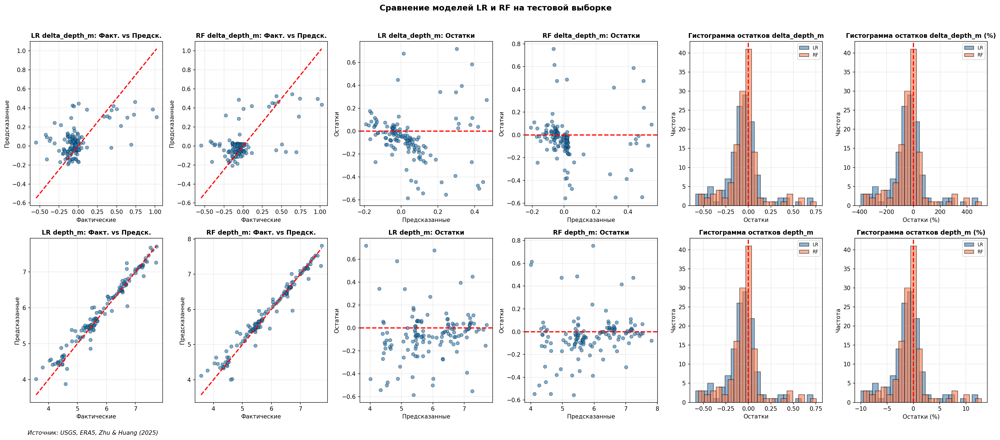
* 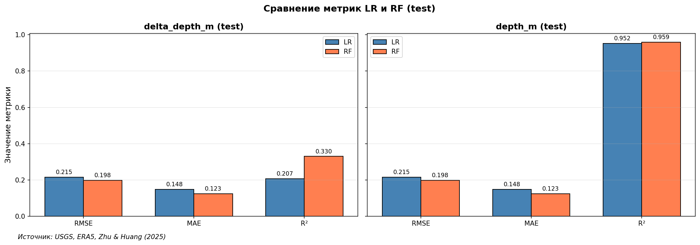
* 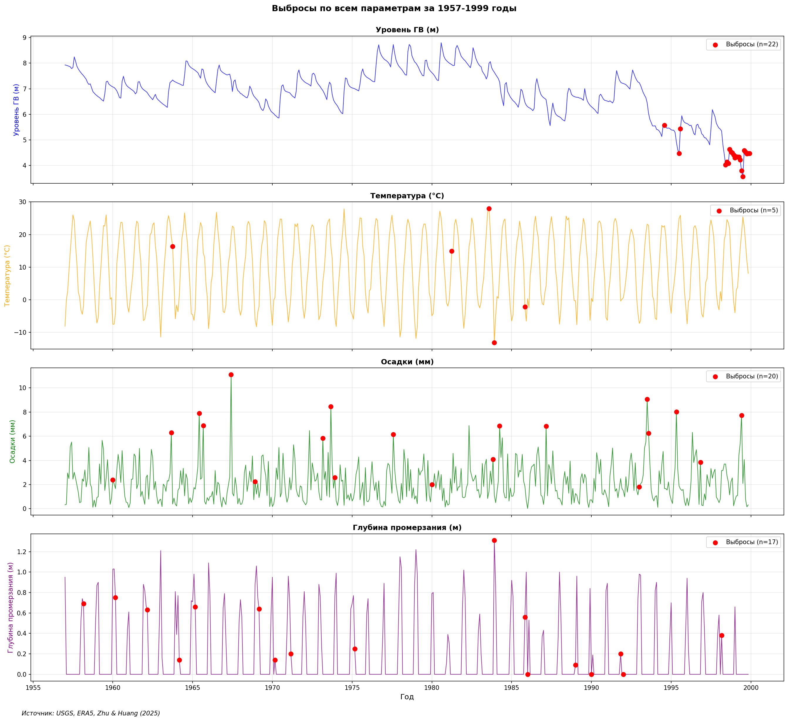
* 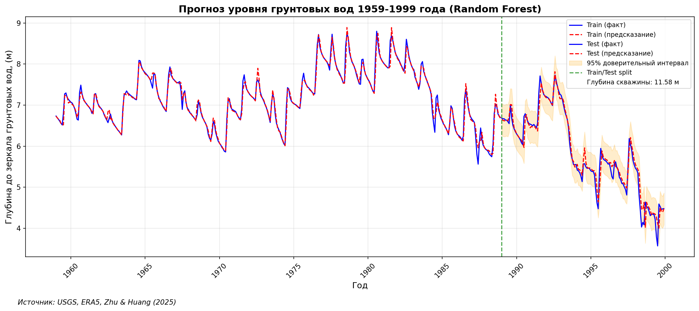
* 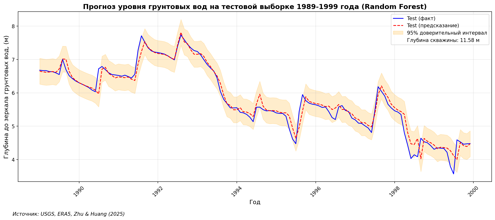
* 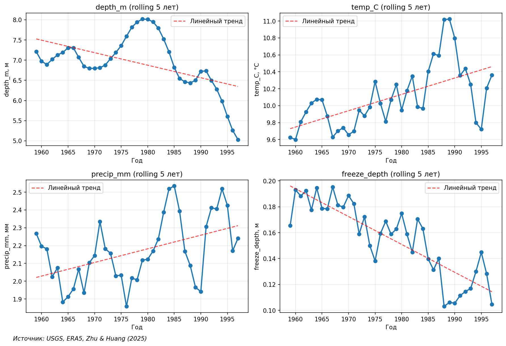
* 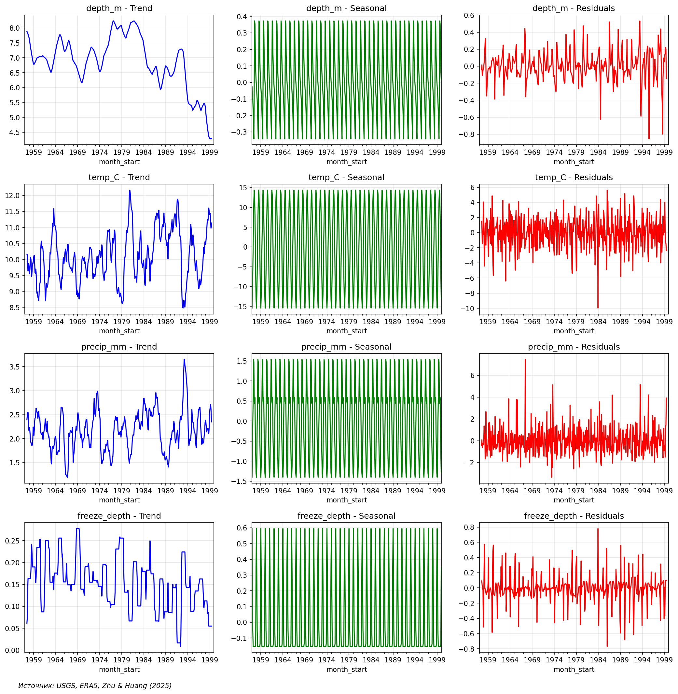

